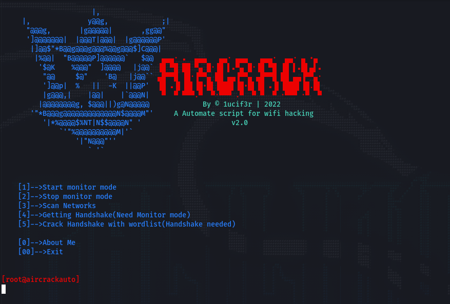

<p align=center>
  </p>
  
  <br>
  
##   <p align="center">AirCrackAuto v2.0<p align="center"> 
  <p align="center">Auto-mate the aircrack-ng all process for wifi hacking<p align="center">
<p align=center>
  <a href="https://www.instagram.com/0x1ucif3r"></a>
  <a href="https://www.instagram.com/0x1ucif3r"></a>
  <a href="https://www.instagram.com/0x1ucif3r"></a>
  <a href="https://github.com/1ucif3r/network/members"></a>
  <a href="https://github.com/1ucif3r"></a>
  


###### <p align="center">*This is official repository maintained by me*
###### <p align="center"> *[**0x1ucif3r**](https://www.instagram.com/0x1ucif3r/) ❤️*
###### <p align="center"> *You can check [Instagram](https://www.instagram.com/0x1ucif3r)✌*
  
  
## AirCrackAuto V2
 
 This tools is for Auto-mate the aircrack-ng all process for wifi hacking . This v2.0 made with python3 and i added/improve some features.
  
<p align="center"></p> 
 
 # Installation

## Installation [Linux](https://wikipedia.org/wiki/Linux) [](https://fr.wikipedia.org/wiki/Linux)

```bash
cd aircrackauto
chmod +x install.sh
./install.sh
```
That's it. You can execute tool by typing **aircrackauto**

 ## YouTube Demo :
  
  https://youtu.be/sJa8465jw0A


 

 ### Development by

Developer / Author: [1ucif3r](https://github.com/1ucif3r/)
